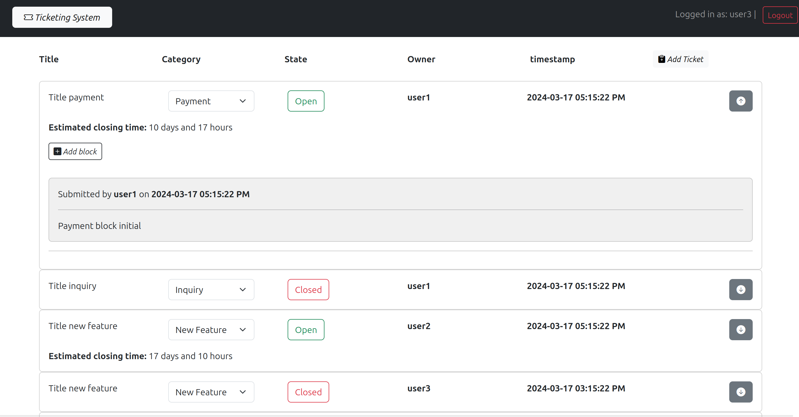
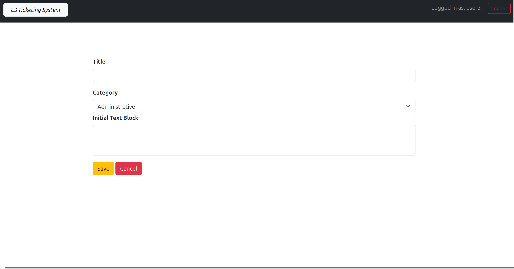
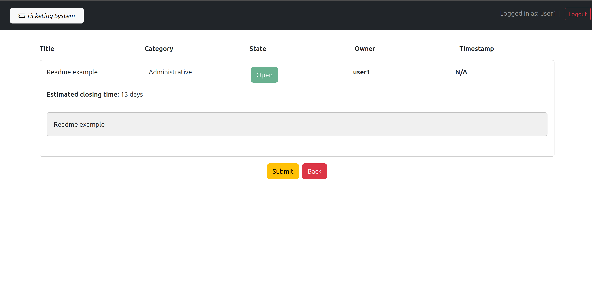

## Run the application:
- execute in client, server and server2 directories:
  ```
  npm ci
  ```
- execute:
  ```
  npm run dev         // only in client directory 
  node index.js       // in server and server2 directory
  
## React Client Application Routes (nodejs)

- Route `/`: Home page, shows the list of all tickets. Logged in users can add tickets, edit tickets' state (from OPEN to CLOSE) owned by them  and see and add additional blocks to any tickets. Logged in user with admin level, in addition, can close and re-OPEN tickets and change category (even if they're not the owner). 
- Route `/login`: login form, allow users to login. After a successful login, the user is redirected to the main route ("/")
- Route `/addTicket`: Ticket form, allow authenticate users to submit a new Ticket specifying all the required data. 
- Route `/addTicket/confirm`: Confirmation page that contain a read-only view of the ticket before submitting. It is possible to go back to `/addTicket` route maintaining the values stored in forms or submit the ticket to the server. After submitting the user will be redirected the the home page `/`
- Route `*`: Page for non existing URLs (Not Found page) that redirects to the home page. 

## API Server

- **GET `/api/tickets`**: Get all the tickets as a json list
  - **Response Body**: JSON object with the list of tickets, or description fo the error 
  ```
  [{"id":13,"state":"open","category":"inquiry","title":"csnjck","ownerID":1,"timestamp":"June 17, 2024 12:37 PM","username":"user1"}, ...]
  ```
  - **Codes**: `200 OK`, `500 Internal Server Error`.

### Authenticated routes

- **POST `/api/tickets`**: Create a new ticket 
  - **Request**: JSON object with the ticket to submit, properties values retrieved from form 
    ```
    {"state":1,"category":"Administrative","title":"Request2","owner":"user1","timestamp":"2024-06-30 01:12:25 PM","initialTextBlock":"Request"}
    ```
  - **Response Body**: Empty on success, or a JSON object with errors description:
    ```
    { error: `Database error during the creation of new ticket: ${err}` }    
    ```
  - **Codes**: `200 OK`, `401 Unauthorized`, `422 Unprocessable Entity` (validation errors), `500 Internal Server Error`.


- **PUT `/api/tickets/:id`**: Update tickets' state or category (only admin). Normal authenticated users can only change state from open to closed, while admin can change state (also close to open) and category
  -**Request Parameter**: ID to identify the ticket to update
  -**Request Body**: JSON object containing ticket ID, state or category (only one value each time the API is called because it is implemented as an inline function from the admin perspective) 

  ```
  {"id":14,"state":"closed"}
  ```
  -**Response Body**: Empty on success, or a JSON object with errors description:
  ```

  { error: 'Not Authorized' }
  { error: 'Ticket closed can not be re-opened if not admin'}
  { error: 'URL and body id mismatch' }
  { error: `Database error during the update of film ${req.params.id}`}

  ```

  - **Codes**: `200 OK`, `400 Bad Request`,`401 Unauthorized`, `422 Unprocessable Entity`, `404 Not Found`, `500 Internal Server Error`

- **GET `/api/textBlocks/:ticketId`**: Get all text blocks related to a ticket give its id 
  -**Request Parameter**: ID to identify the ticket related to text blocks
  -**Response Body**: JSON list of text blocks related to the ticket, or a JSON object with a message to notify the absence of any text block for the ticket, or a JSON object with errors description:
  ```
  [{"id":1,"description":"Payment block initial","timestamp":"2024-03-17 05:15:22 PM","ownerID":1,"ticketId":1,"username":"user1"}]
  ```
  ```
  {error: 'Invalid request'}
  
  ```
  
  -**Codes**: `200 OK`, `401 Unauthorized`, `404 Not Found`, `422 Unprocessable Entity`, `500 Internal Server Error`

- **POST `/api/textBlocks`**: Create a new text Block for a ticket
  -**Request Body**: JSON object containing needed information to create a text block (ticketID, description, timestamp)
  ```
  {ticketId: 1, description: "readme description ticket block", timestamp: 2024-06-07 10:10:10 AM}
  ```
  -**Response Body**: Empty on success, or a JSON object with errors description:
  ```
  {error: 'Cannot add text blocks to a closed ticket, try refresh the content'}
  {error: 'Invalid ticketId' }
  
  ```
  -**Codes**: `200 OK`, `401 Unauthorized`, `404 Not Found`, `422 Unprocessable Entity`, `500 Internal Server Error`

- **GET `/api/auth-token`**: Returns ana auth token to the logged in user
  - **Response Body**: JSON object with token
  - **Token payload**: access privileges and userId
  ```
  { access: "admin", userId: 3}
  ```
  - **Codes**: `200 OK`, `401 Unauthorized`


### Authentication APIs
* **POST `/api/sessions`**: Authenticate and login the user
  - **Request**: JSON object with username and  password:
  ```
  { "username": "u1@p.it", "password": "pwd"}
  ```
  - **Response**: JSON object with user's info, or a description of errors:
  ```
  {"email":"u1@p.it","username":"user1","level":"normal"}
  ```
  - **Codes**: `200 OK`, `400 Bad Request`, `401 Unauthorized`

* **DELETE `api/sessions`**: Logout the user
  - **Codes**: `200 OK`, `401 Unauthorized`

* **GET `api/sessions/current`**: Get info of the logged user
  - **RESPONSE**: JSON object with same user's infor of `/api/sessions`
  - **Codes**: `200 OK`, `401 Not Authorized`


## API Server2

- **GET `/api/estimation`**: get the estimation closing time for a ticket. It is shown only in the confirmation page when creating a ticket for authenticated users with normal access privileges, while it is shown also for every ticket in the homepage for admin users. The computed estimation time has a day-level precision for normal users, while it has a hour-level precision for admin.
  - **Request Headers**: JWT token with access privileges 
  - **Request Body**: JSON object containing ticket information used for computing the estimation time: title and category.
  ```
  {title: "Title readme", category:"payment"}
  ```
  - **Response Body**: JSON object eith the estimation time:
  ```
  {"estimation":"17 days and 12 hours"}
  ```
  - **Codes**: `200 OK`, `400 Bad Request`,`401 Unauthorized`


## Database Tables

- Table `users` - contains id, email, username, hash (hashed password), salt, level
- Table `tickets` - contains id, state, category, owner ID, title, timestamp
- Table `text_block` - contains id, description, timestamp, ticket ID, owner ID

## Main React Components
All the following components resides in the /Component folder

- `App` (in `App.jsx`): is the App component containing the state of the App. It implements the logic regarding the organization of the routes, states and Application-useful functions.
- `GenericLayout` (in `Layout.jsx`): proper home page, it contains the list of tickets and, when a user is authenticated, it can also show the related text blocks
- `LoginForm` (in `Auth.jsx`):  the login form that users can use to login into the app. This is responsible for the client-side validation of the login credentials (valid email and non-empty password).
- `TicketList` (in `TicketList.jsx`): list of all tickets. It is implemented as a wrapper round a Bootstrap accordion component. 
- `TicketItem` (in `TicketList.jsx`): a single tickets in the TicketList. It shows all the needed information about the ticket and there is implemented the logic to show things according to the permission of the user (generic/authenticated/admin). It includes buttons to add a new Ticket, a new Ticket Block, rehydrate the content and optionally to change the tickets properties.
- `TicketBlockItem` (in `TicketList.jsx`): a single text block of a ticket. It shows the text Block information as text, and it is shown only when the ticket is expandend (authenticated users).
- `ModalButton` (in `TicketList.jsx`): Button to add a new ticket block implemented using a bootstrap Modal Component. It is possible to add the description of the text block to add in a form that is shown in the same route (`/`) 
- `ConfirmTicketLayout` (in `Layout.jsx`): Components that shows a summary of the ticket to be added displayed in a read-only fashion.


## Screenshot





## Users Credentials

|   email   | password | username |  level  |
|-----------|----------|----------|---------|
| u1@p.it   |   pwd    |  user1   | normal  |
| u2@p.it   |   pwd    |  user2   | normal  |
| u3@p.it   |   pwd    |  user3   |  admin  |
| u4@p.it   |   pwd    |  user4   | normal  |
| u5@p.it   |   pwd    |  user5   |  admin  |
